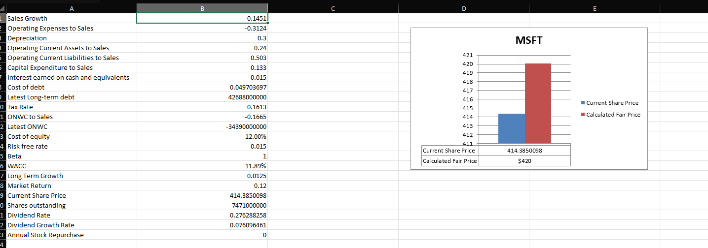

# Fair-Price-Per-Share-Calculator
THE SOFTWARE IS PROVIDED "AS IS", WITHOUT WARRANTY OF ANY KIND, EXPRESS OR IMPLIED, INCLUDING BUT NOT LIMITED TO THE WARRANTIES OF MERCHANTABILITY, FITNESS FOR A PARTICULAR PURPOSE AND NONINFRINGEMENT. IN NO EVENT SHALL THE AUTHORS OR COPYRIGHT HOLDERS BE LIABLE FOR ANY CLAIM, DAMAGES OR OTHER LIABILITY, WHETHER IN AN ACTION OF CONTRACT, TORT OR OTHERWISE, ARISING FROM, OUT OF OR IN CONNECTION WITH THE SOFTWARE OR THE USE OR OTHER DEALINGS IN THE SOFTWARE.

<b>What it does (and may do in the future)</b>
1. Downloads Financial Reports associated with US Ticker symbol from Morningstar
2. Calculate Value Drivers - Sales Growth, Operating Assets/Liabilities to Sales, Capital Expenditure, Cost of Equity, Cost of Debt, and Estimate Weighted Average Cost of Capital 
3. Project future potential financial performance for companies that report "Business Revenue" (Future enahncements to support banks and financial company stocks in development).
    -Estimates share price based on long term growth potential (default = 1.25%) of yearly free cash flows
   
  
   

<b>To Use:</b>
1. download packages in requirements
2. type in desired ticker symbol (line 13 on main.py)
3. run main.py using a Python 3.5

<b>How it works:</b>
1. This script will download 5 years financial data from Morningstar
     -MS_Financial_Downloader.py parses JSON statements via info associated with ticker symbol from tickers.db
     -Create a directory with the ticker symbol name
     -Load financial statements to CSV format
2. Calculate value drivers 
     -Calculate_Value_Drivers.py
4. Project valuation on excel for desired amount of years. (line 35 last parameter denotes years_to_project)
     -FPPS_Excel_Injector.py

<b>TO USE:</b> 
1. Download and extract files.
2. Install required packages:
    pip install -r [Folder Path]/Fair-Price-Per-Share-Calculator/requirments.txt

3. <b>Run main file:</b>
    python <i>[Folder Path]</i>/Fair-Price-Per-Share-Calculator/alt_main.py

4. Enter the ticker desired ticker symbol.

5. Data will be extracted to the script folder by ticker symbol.

<b>Warnings about the data:</b> 
1. Depreciation is not calculated... because most companies do not share "Gross, property plant and equipment" on their balance sheets. It is defaulted at 40%, much higher than most companies actually depreciate their equipment. You can calculate this by dividing total "Depreciation" from cash flow sheet by "Gross, property plant and equipment" usually provided in the actual annual 10k.

<b>Pending  Working on:</b>
1. Refactor the excel data injection methods. Would like to include named variables to quickly ascertain meaning behind cell references in final file output
2. Data calls directly to the dict structs need to be removed and encapsulated for error handling.
3. Comments need to be added to each class, functions, and variables within
4. Being a better person

